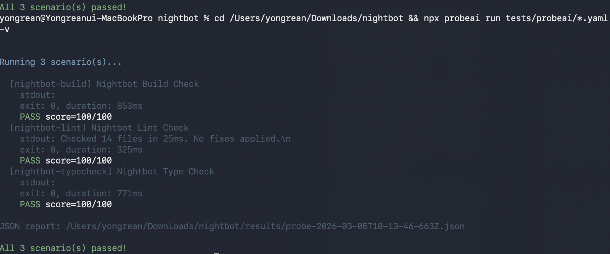
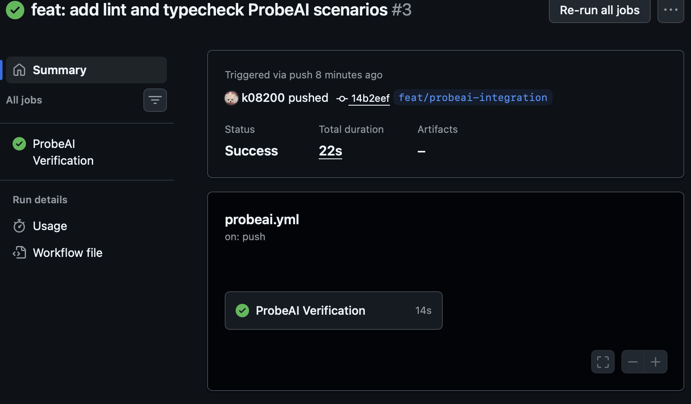

# ProbeAI

Test and evaluate AI coding agents with YAML scenarios.

ProbeAI runs your AI agent, captures its output, and scores it using rule-based checks and LLM judges. Get a pass/fail verdict with detailed reports.

<p align="center">
  
  <br />
  <em>Run scenarios locally with <code>probeai run</code></em>
</p>

<p align="center">
  
  <br />
  <em>Automate with GitHub Actions — get green checks on every push</em>
</p>

## Install

```bash
npm install -g probeai
```

Or run directly:

```bash
npx probeai run my-scenario.yaml
```

## Quick Start

**1. Create a scenario file** (`test-my-agent.yaml`):

```yaml
id: hello-test
name: "Hello World Test"
description: "Check that my agent can echo hello"

agent:
  type: command
  command: "echo 'Hello from agent'"

steps:
  - action: check_output
    expect: "Hello"

evaluate:
  method: rules
  passThreshold: 100
  rules:
    - type: contains
      target: stdout
      value: "Hello from agent"
      weight: 1
    - type: exit_code
      target: exit
      value: "0"
      weight: 1
```

**2. Run it:**

```bash
probeai run test-my-agent.yaml
```

**3. See results:**

```
Running 1 scenario(s)...

  [hello-test] Hello World Test
    PASS score=100/100

All 1 scenario(s) passed!
```

## Usage

```bash
# Run one or more scenarios
probeai run scenario.yaml
probeai run tests/*.yaml

# Verbose output (shows stdout, stderr, timing)
probeai run scenario.yaml -v

# Generate markdown report
probeai run scenario.yaml --md

# Custom output directory
probeai run scenario.yaml -o ./my-results

# Validate scenario files without running
probeai validate scenario.yaml
```

## Scenario Format

A scenario is a YAML file with 4 sections:

### agent

What to run. Currently supports `command` type (runs a shell command).

```yaml
agent:
  type: command
  command: "my-agent --task 'do something'"
  env:
    API_KEY: "test-key"
```

### steps

Actions to perform during the run.

```yaml
steps:
  - action: send           # Send input to stdin
    input: "hello"
  - action: wait           # Wait for N ms
    duration: 2000
  - action: check_output   # Mark output for evaluation
    expect: "success"
  - action: check_file     # Mark file for evaluation
    path: "./output.txt"
```

### evaluate

How to score the result. Three methods:

**Rules only** — deterministic checks:
```yaml
evaluate:
  method: rules
  passThreshold: 80
  rules:
    - type: contains        # stdout/stderr contains string
      target: stdout
      value: "success"
    - type: regex           # regex match (case-insensitive)
      target: stdout
      value: "(ok|done|success)"
    - type: exit_code       # process exit code
      target: exit
      value: "0"
    - type: file_exists     # file was created
      target: file
      value: "./output.txt"
    - type: json_match      # JSON key-value match
      target: stdout
      value: '{"status":"ok"}'
```

**LLM only** — Ollama judges the output:
```yaml
evaluate:
  method: llm
  model: "qwen2.5-coder:14b"
  rubric: |
    Did the agent complete the task correctly?
    Score 0-100 based on correctness and completeness.
```

**Hybrid** — average of rules + LLM:
```yaml
evaluate:
  method: hybrid
  passThreshold: 60
  model: "qwen2.5-coder:14b"
  rubric: "Evaluate the output quality."
  rules:
    - type: exit_code
      target: exit
      value: "0"
```

### Other options

```yaml
id: unique-id              # Required
name: "Human readable"     # Required
description: "What this tests"
timeout: 120               # Seconds (default: 120)
```

## Templates

Starter templates in `templates/`:

- **cli-smoke.yaml** — Quick check that a CLI runs without crashing
- **agent-task.yaml** — Full AI agent task with hybrid evaluation
- **api-health.yaml** — HTTP endpoint health check

Copy and edit:
```bash
cp node_modules/probeai/templates/cli-smoke.yaml my-test.yaml
```

## Reports

ProbeAI generates JSON reports by default. Add `--md` for markdown.

```bash
probeai run tests/*.yaml --md -o ./reports
```

Reports include:
- Pass/fail per scenario
- Score breakdown (rule results, LLM reasoning)
- Execution duration
- Overall summary

## GitHub Actions

Run ProbeAI automatically on every PR and push.

**1. Add scenarios** to your repo (e.g. `tests/probeai/build-check.yaml`):

```yaml
id: build-check
name: "Build Check"
description: "Verify the project compiles"

agent:
  type: command
  command: "npx tsc --noEmit 2>&1"

steps:
  - action: check_output
    expect: ""

evaluate:
  method: rules
  passThreshold: 100
  rules:
    - type: exit_code
      target: exit
      value: "0"
      weight: 1
```

More scenario ideas:

```yaml
# Lint check
id: lint-check
name: "Lint Check"
agent:
  type: command
  command: "npx biome check src/ 2>&1"
steps:
  - action: check_output
    expect: ""
evaluate:
  method: rules
  passThreshold: 100
  rules:
    - type: exit_code
      target: exit
      value: "0"
      weight: 1
```

```yaml
# Test check
id: test-check
name: "Test Check"
agent:
  type: command
  command: "npm test 2>&1"
steps:
  - action: check_output
    expect: ""
evaluate:
  method: rules
  passThreshold: 100
  rules:
    - type: exit_code
      target: exit
      value: "0"
      weight: 1
```

**2. Create workflow** (`.github/workflows/probeai.yml`):

```yaml
name: ProbeAI

on:
  pull_request:
  push:

jobs:
  verify:
    name: ProbeAI Verification
    runs-on: ubuntu-latest
    steps:
      - uses: actions/checkout@v4

      - uses: actions/setup-node@v4
        with:
          node-version: 20

      - run: npm install

      - name: Run ProbeAI scenarios
        run: npx probeai run tests/probeai/*.yaml -v
```

**3. Push and check** — ProbeAI results appear as a GitHub check on your PRs.

## Programmatic Usage

Use ProbeAI as a library in your Node.js code:

```typescript
import { probe, loadScenarios } from "probeai";

const scenarios = loadScenarios(["tests/build.yaml", "tests/lint.yaml"]);
const results = await probe(scenarios, {
  outputDir: "./results",
  markdown: false,
  verbose: false,
});

const failed = results.filter((r) => !r.evaluation.passed);
if (failed.length > 0) {
  console.log(`${failed.length} scenario(s) failed`);
  process.exit(1);
}
```

## Requirements

- Node.js 20+
- For LLM evaluation: [Ollama](https://ollama.ai) running locally

## License

MIT
